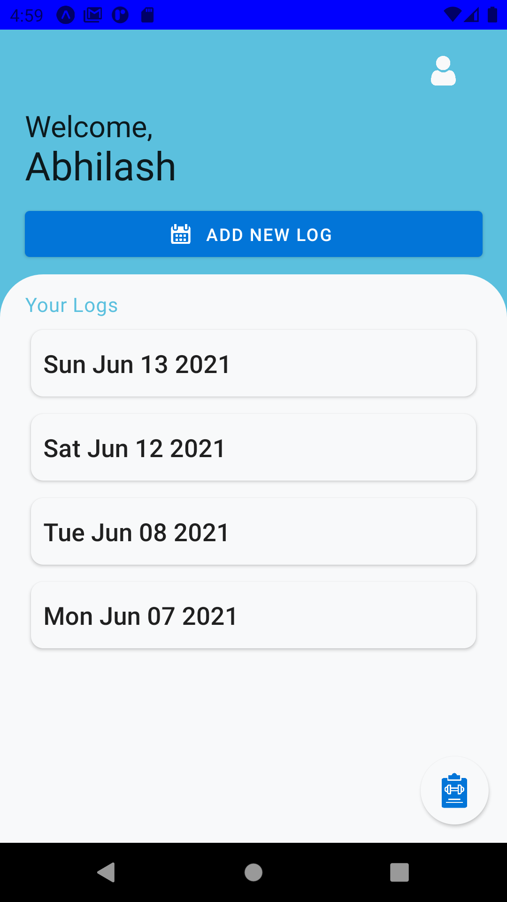
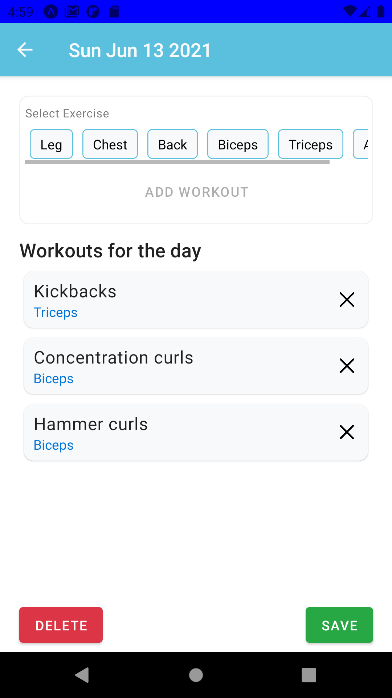
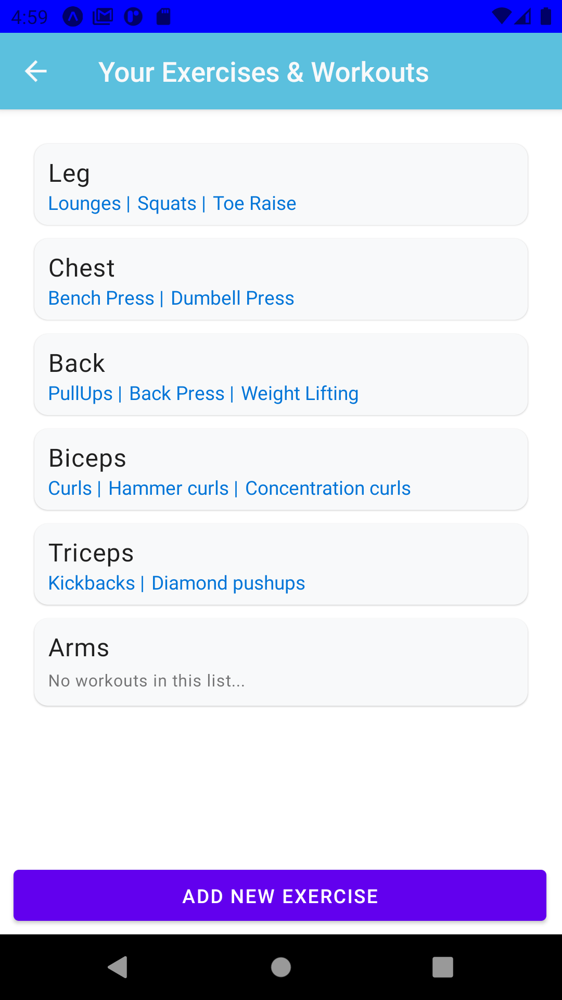

# ExerLog App

> A simple exercise tracker for day to day workouts.

<h6>
#1 Home Screen | #2 Logs(for selected date) | #3 Your Exercises 
</h6>

[Similar Web App](https://github.com/A7abhilash/exerlog)
